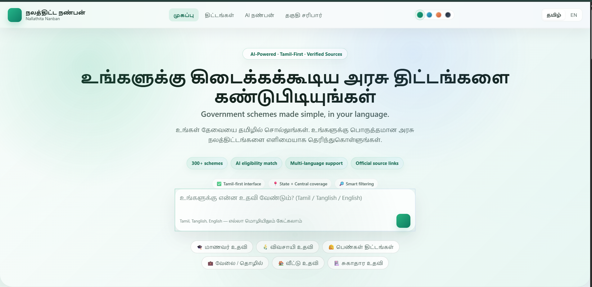
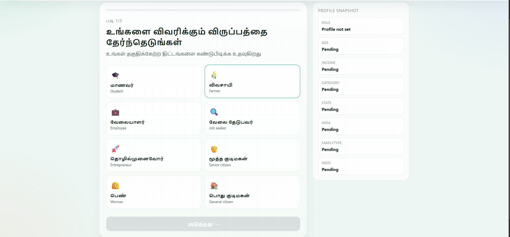
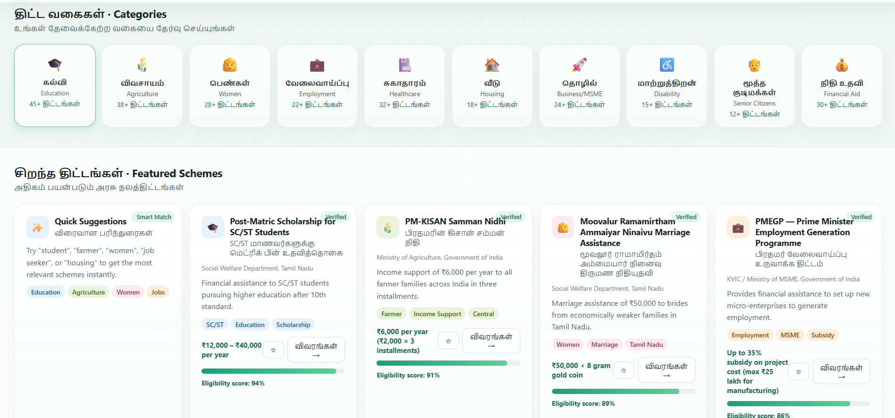
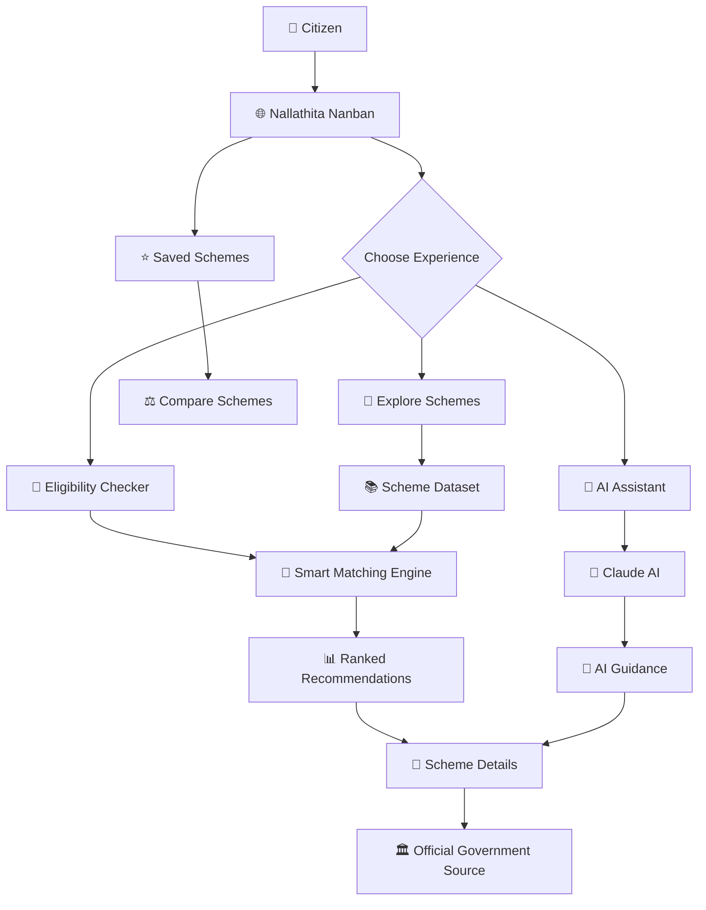
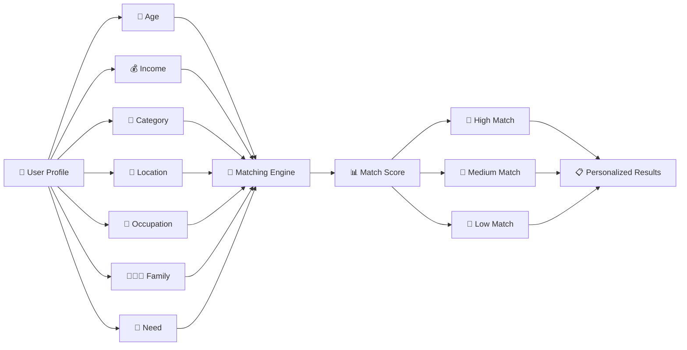
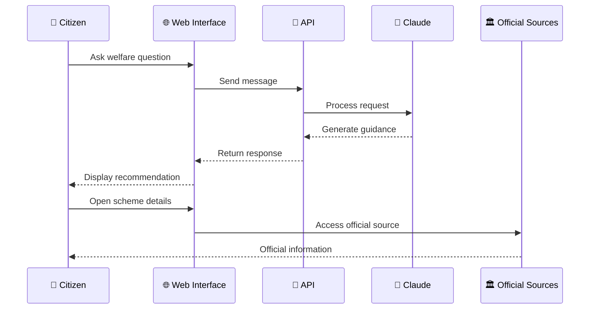
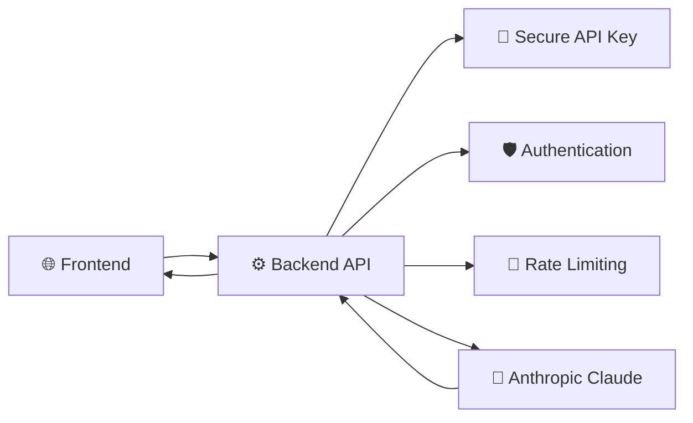

# 🇮🇳 நலத்திட்ட நண்பன் · Nallathita Nanban

### AI-Powered Government Welfare Scheme Discovery Platform

<p align="center">
  <strong>Making Government Welfare Schemes Simple, Accessible & Intelligent</strong>
</p>

<p align="center">
  
  
  
  
  
  
</p>

<p align="center">
  
  
  
</p>

---

## 🏛️ Overview

**Nallathita Nanban (நலத்திட்ட நண்பன்)** is an AI-powered civic-tech platform designed to help citizens discover **Tamil Nadu and Central Government welfare schemes** that may be relevant to them.

Instead of searching through multiple government websites and trying to understand complicated eligibility requirements, users can simply describe their needs and receive structured guidance.

> **"Tell us your need. Discover relevant government welfare schemes easily."**

The platform combines **Artificial Intelligence, smart eligibility matching, bilingual interaction and structured welfare-scheme information** into a single citizen-friendly experience.

---

## 🎯 The Problem

Government welfare schemes are valuable, but discovering the right scheme can be difficult.

### Traditional Experience

```text
👤 Citizen
      ↓
🔎 Search multiple websites
      ↓
📄 Read complicated eligibility rules
      ↓
📋 Find required documents
      ↓
🌐 Find application portal
      ↓
❓ Still unsure whether eligible
```

### Nallathita Nanban

```text
👤 Citizen
      ↓
💬 Tell us your situation
      ↓
🤖 AI + Smart Matching
      ↓
🎯 Relevant Schemes
      ↓
✅ Eligibility
      ↓
💰 Benefits
      ↓
📄 Documents
      ↓
📝 Application Guidance
      ↓
🏛️ Official Government Source
```

---

# 💡 Our Solution

Nallathita Nanban acts as a **digital welfare discovery companion**.

It helps users:

- 🔎 Discover relevant welfare schemes
- 🤖 Ask questions using natural language
- 🎯 Check potential eligibility
- 📊 Receive personalized match scores
- 📄 Understand required documents
- 📝 Understand application steps
- ⭐ Save useful schemes
- ⚖️ Compare multiple schemes
- 🌐 Access official government sources
- 🇮🇳 Use the platform in Tamil or English

---

# 📸 Platform Preview

## 🏠 Dashboard

<p align="center">
  
</p>

The dashboard provides a centralized entry point for welfare discovery, quick searches, featured schemes and personalized recommendations.

---

## 🎯 Eligibility Checker

<p align="center">
  
</p>

The guided eligibility experience collects user information and uses it to identify schemes that may be relevant to the user's profile.

---

## 📚 Scheme Explorer

<p align="center">
  
</p>

Users can explore schemes through structured cards containing benefits, target beneficiaries, match scores and official sources.

---

# 🤖 AI நண்பன் — AI Welfare Assistant

The platform includes an AI conversational assistant designed specifically for welfare-scheme discovery.

Users can ask questions naturally:

```text
"I am a college student from Tamil Nadu.
My family income is below ₹2.5 lakh.
What scholarships can I apply for?"
```

The assistant provides structured guidance covering:

```text
🎯 Recommended Scheme

💰 Benefits

✅ Eligibility

📄 Required Documents

📝 Application Guidance

🏛️ Official Government Website
```

The AI assistant is designed to avoid fabricating scheme names, benefits, URLs or eligibility requirements and to clearly communicate that final eligibility is determined by the relevant government authority.

---

# 🎯 Smart Eligibility Checker

The platform contains a guided multi-step eligibility wizard.

It considers information such as:

| User Information | Purpose |
|---|---|
| 👤 Role | Student, farmer, worker, etc. |
| 🎂 Age | Age-specific schemes |
| 💰 Income | Income-based eligibility |
| 🪪 Category | Category-specific schemes |
| 📍 Location | State / area relevance |
| 🏡 Area | Rural / urban relevance |
| 👨‍👩‍👧 Family Situation | Family-based schemes |
| 🎯 Need | Education, healthcare, finance, etc. |

---

# 🧠 Smart Matching Engine

The platform doesn't simply display schemes randomly.

It calculates a **compatibility / match score** based on the user's profile.

### Example

```text
┌──────────────────────────────────────┐
│ 🎓 Post-Matric Scholarship           │
│                                      │
│ ███████████████████░ 94%             │
│                                      │
│ High Match                           │
└──────────────────────────────────────┘

┌──────────────────────────────────────┐
│ 🌾 PM-KISAN                          │
│                                      │
│ ██████████████████░░ 91%             │
│                                      │
│ High Match                           │
└──────────────────────────────────────┘
```

The matching engine considers factors such as:

- Category
- Age
- State
- Occupation / Role
- Required Need
- Income
- Scheme Category
- Rural / Urban Context

---

# 🔄 System Architecture



---

# 🎯 Eligibility Matching Flow



---

# 🤖 AI Conversation Architecture



---

# ✨ Key Features

## 🤖 AI-Powered Assistance

Natural-language welfare discovery using an AI conversational interface.

## 🎯 Eligibility Matching

Profile-based scheme recommendations with compatibility scores.

## 🔎 Scheme Discovery

Search and explore structured welfare-scheme information.

## 🇮🇳 Bilingual Interface

Tamil and English support for improved accessibility.

## ⭐ Save Schemes

Bookmark schemes for future reference.

## ⚖️ Compare Schemes

Compare saved schemes based on:

- Category
- Benefits
- Target group
- Government level
- Official source

## 📄 Detailed Scheme Information

Each scheme can contain:

```text
Scheme Name
     ↓
Tamil Name
     ↓
Department
     ↓
Description
     ↓
Benefits
     ↓
Eligibility
     ↓
Required Documents
     ↓
Application Steps
     ↓
Official Government Website
```

## 🎨 Multiple Themes

```text
🟢 Emerald
🔵 Ocean
🟠 Sunset
🌑 Midnight
```

---

# 🏛️ Welfare Categories

| Category | Icon | Focus |
|---|---:|---|
| Education | 🎓 | Scholarships & education |
| Agriculture | 🌾 | Farmer support |
| Women | 👩 | Women & family welfare |
| Employment | 💼 | Jobs & skills |
| Healthcare | 🏥 | Health support |
| Housing | 🏠 | Housing assistance |
| Finance | 💰 | Financial assistance |
| Disability | ♿ | Disability welfare |
| Senior Citizens | 👴 | Senior welfare |

---

# 🛠️ Technology Stack

<p align="center">
  
</p>

| Technology | Purpose |
|---|---|
| HTML5 | Application structure |
| CSS3 | UI / Responsive Design |
| JavaScript | Application logic |
| Anthropic Claude | AI Assistant |
| REST API | AI Communication |
| Rule-Based Matching | Eligibility Scoring |
| Government Portals | Official Information |

---

# 📂 Project Structure

```text
nallathita-nanban/
│
├── 📄 README.md
│
├── 🌐 nallathita_nanban_platform.html
│
├── 🖼️ Dashboard.png
├── 🖼️ eligibility.png
├── 🖼️ schemes.png
│
├── 🖼️ Screenshot 2026-08-14 092519.png
└── 🖼️ Screenshot 2026-08-14 092536.png
```

The current prototype is implemented as a self-contained HTML application containing the interface, styling, scheme data and JavaScript functionality.

---

# ⚡ Getting Started

## 1. Clone the Repository

```bash
git clone https://github.com/<your-username>/nallathita-nanban.git
cd nallathita-nanban
```

## 2. Run Locally

### Option 1 — Open Directly

Open:

```text
nallathita_nanban_platform.html
```

### Option 2 — Python Server

```bash
python -m http.server 8000
```

Then open:

```text
http://localhost:8000
```

### Option 3 — VS Code

Use the **Live Server** extension.

---

# 🔐 Production Architecture

For production deployment, the AI API should be placed behind a secure backend.



### Production Priorities

- 🔐 Protect API credentials
- 🛡️ Add authentication
- 🚦 Implement rate limiting
- 🧹 Validate user input
- 📊 Add database infrastructure
- 🔄 Automate government data updates
- 🏛️ Verify official sources
- ♿ Perform accessibility testing
- 🔒 Establish privacy policies

---

# 🗺️ Roadmap

## Phase 1 — Prototype ✅

- [x] Welfare scheme catalogue
- [x] Tamil + English interface
- [x] AI assistant
- [x] Eligibility checker
- [x] Smart matching
- [x] Match scores
- [x] Saved schemes
- [x] Scheme comparison
- [x] Multiple themes
- [x] Official source links

## Phase 2 — Productization 🚀

- [ ] Secure backend
- [ ] Database
- [ ] Government data integration
- [ ] User accounts
- [ ] Personalized dashboard
- [ ] Application tracking
- [ ] PWA / Mobile experience

## Phase 3 — AI Intelligence 🧠

- [ ] RAG-based government knowledge system
- [ ] Semantic search
- [ ] Automated source verification
- [ ] Advanced eligibility reasoning
- [ ] Multilingual AI
- [ ] Voice-based discovery
- [ ] Document assistance

## Phase 4 — Citizen Platform 🇮🇳

- [ ] Tamil Nadu-wide expansion
- [ ] Central Government integration
- [ ] State-wise expansion
- [ ] CSC / public-service integration
- [ ] NGO ecosystem integration
- [ ] Accessibility-first deployment

---

# 🌱 Vision

Nallathita Nanban aims to transform welfare discovery from:

```text
Search
   ↓
Read
   ↓
Confusion
   ↓
Search Again
```

into:

```text
Ask
 ↓
Understand
 ↓
Match
 ↓
Verify
 ↓
Act
```

### Long-Term Vision

```text
                         🇮🇳 CITIZEN
                              │
                              ▼
                  ┌─────────────────────┐
                  │  NALLATHITA NANBAN  │
                  └──────────┬──────────┘
                             │
              ┌──────────────┼──────────────┐
              ▼              ▼              ▼
          🔎 DISCOVER     🤖 UNDERSTAND    🎯 MATCH
              │              │              │
              └──────────────┼──────────────┘
                             ▼
                       📋 TAKE ACTION
                             │
                             ▼
                    🏛️ OFFICIAL PORTAL
```

> **Technology should reach people — not make people chase technology.**

---

# 🤝 Contributing

Contributions are welcome!

```bash
git checkout -b feature/your-feature

git add .

git commit -m "feat: add your feature"

git push origin feature/your-feature
```

Then open a Pull Request.

### Contribution Areas

- 🤖 Artificial Intelligence
- 🧮 Eligibility Algorithms
- 🎨 UI/UX
- 🌐 Tamil Localization
- ♿ Accessibility
- 📱 Mobile / PWA
- 🏛️ Government Data
- 🔐 Security
- 🧪 Testing

---

# ⚠️ Disclaimer

Nallathita Nanban is a **technology prototype intended for welfare-scheme discovery and guidance**.

Information provided by the platform should **not be considered an official government eligibility determination**.

Users should always verify the latest:

- Eligibility requirements
- Benefits
- Documents
- Application deadlines
- Application procedures

through the relevant official government authority or portal.

---

# 👨‍💻 Author

<p align="center">

### P. Aravind

<strong>AI & Data Science Student</strong>

Artificial Intelligence • Data Science • Civic-Tech • Product Development

</p>

---

# ⭐ Support the Project

If you find **Nallathita Nanban** useful:

⭐ **Star** the repository  
🍴 **Fork** the project  
🐛 **Report** issues  
💡 **Suggest** improvements  
🤝 **Contribute**

---

<p align="center">

## 🇮🇳 நலத்திட்ட நண்பன்

### Government Welfare · Simplified · Intelligent · Accessible

<strong>Built with ❤️ for citizens</strong>

</p>
