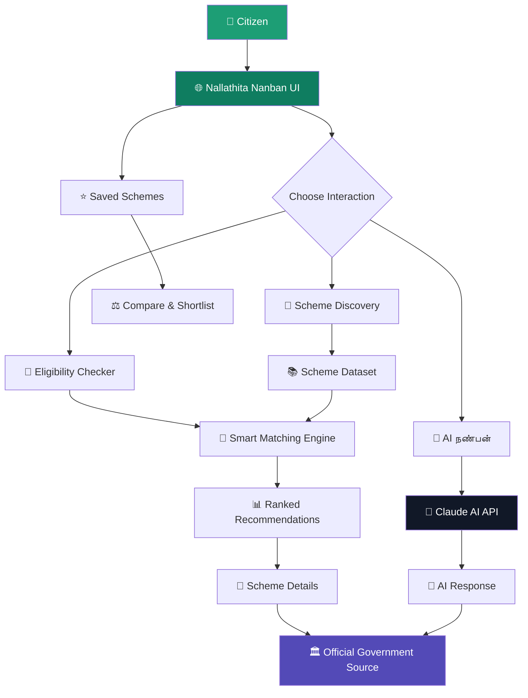
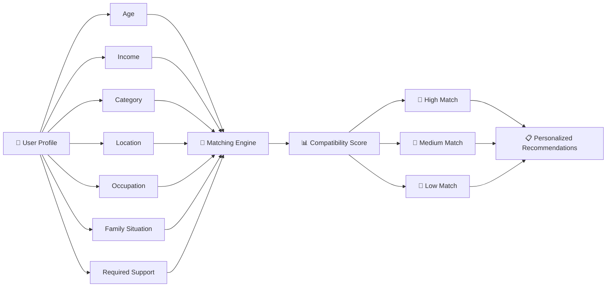
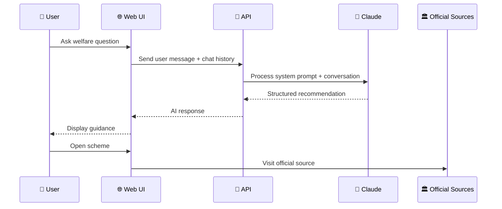
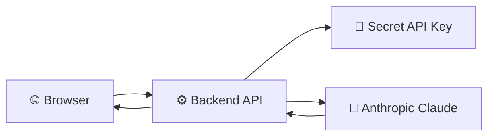

# 🇮🇳 நலத்திட்ட நண்பன் · Nallathita Nanban

### AI-Powered Government Welfare Scheme Discovery Platform

<p align="center">
  <strong>Discover the government welfare schemes you may be eligible for — simply, intelligently, and in your language.</strong>
</p>

<p align="center">
  
  
  
  
  
  
</p>

<p align="center">
  
  
  
  
</p>

---

## 🏛️ What is Nallathita Nanban?

**Nallathita Nanban (நலத்திட்ட நண்பன்)** is a civic-tech platform designed to make government welfare schemes easier to discover and understand.

Instead of forcing citizens to search through multiple government websites and understand complicated eligibility requirements, the platform brings scheme discovery into a single, citizen-friendly interface.

> **Tell us your need. Discover relevant Tamil Nadu and Central Government welfare schemes easily.**

The platform combines:

* 🤖 AI-powered conversational assistance
* 🎯 Profile-based eligibility matching
* 🔎 Welfare scheme discovery
* 🇮🇳 Tamil Nadu + Central Government schemes
* 🌐 Tamil + English support
* 📄 Eligibility, documents and application guidance
* ⭐ Saved schemes and comparison
* 🎨 Multiple visual themes
* 📊 Smart match scores
* 🔗 Official government source links

---

## ✨ Product Vision

> **Government welfare should not be difficult to discover.**

Millions of citizens may qualify for scholarships, agricultural assistance, employment programmes, healthcare support, housing assistance and other welfare initiatives — but discovering the *right* scheme can be difficult.

Nallathita Nanban aims to become a **citizen-first welfare discovery layer** that simplifies this journey:

```text
Citizen Need
     ↓
Understand the User
     ↓
Find Relevant Schemes
     ↓
Match Eligibility
     ↓
Explain Benefits & Requirements
     ↓
Direct to Official Source
     ↓
Citizen Takes Action
```

---

# 🚀 Core Features

## 🤖 1. AI நண்பன் — AI Welfare Assistant

Users can describe their situation naturally instead of searching with complicated keywords.

Example:

```text
"I am a college student from Tamil Nadu.
My family income is below ₹2.5 lakh.
Are there any scholarships available for me?"
```

The AI assistant can respond with structured information covering:

* 🎯 Recommended scheme
* 💰 Benefits
* ✅ Eligibility
* 📄 Required documents
* 📝 Application guidance
* 🏛️ Official website

The assistant is explicitly instructed to avoid fabricating schemes, benefits, URLs or eligibility criteria and to communicate that final eligibility is determined by the concerned government authority.

---

## 🎯 2. Smart Eligibility Checker

A guided **8-step eligibility wizard** collects relevant user information.

The flow considers information such as:

* 👤 User role
* 🎂 Age
* 💰 Income
* 🪪 Category
* 📍 State
* 🏡 Rural / urban area
* 👨‍👩‍👧 Family situation
* 🎯 Required type of assistance

The final stage produces personalized scheme recommendations.

The platform's wizard includes education, finance, agriculture, employment, healthcare and housing needs.

---

## 📊 3. Smart Match Engine

Rather than simply displaying a huge list of schemes, the platform calculates a **profile-to-scheme fit score**.

Example:

```text
Post-Matric Scholarship
███████████████████░ 94%

PM-KISAN
██████████████████░░ 91%

Employment Support
████████████████░░░░ 82%
```

The matching engine considers factors such as:

* User category
* Age
* Occupation
* State
* Area
* Required assistance
* Income
* Scheme category

For example, the current implementation increases matching scores for relevant SC/ST, OBC, senior citizen, student, employment and Tamil Nadu state conditions.

---

## 🔎 4. Welfare Scheme Explorer

Users can browse welfare schemes through structured cards containing:

* Scheme name
* Tamil name
* Department
* Description
* Benefits
* Target beneficiaries
* Tags
* Eligibility score
* Verification indicator
* Scheme details
* Official source

The interface supports featured schemes, curated top matches and a broader scheme catalogue.

---

## ⭐ 5. Save & Compare

Users can bookmark schemes and build a personal shortlist.

Saved schemes can be compared based on:

| Comparison      | Details                     |
| --------------- | --------------------------- |
| Category        | Scheme domain               |
| Benefit         | Financial / service benefit |
| Target          | Intended beneficiaries      |
| Level           | State / Central             |
| Official Source | Government website          |

The application also supports downloading a saved shortlist as a text file.

---

## 🌐 6. Tamil + English Experience

The platform is designed around bilingual accessibility.

### தமிழ்

> உங்களுக்கு கிடைக்கக்கூடிய அரசு திட்டங்களை கண்டுபிடியுங்கள்

### English

> Discover government schemes you are eligible for

The interface dynamically switches between Tamil and English while maintaining the same discovery workflow.

---

## 🎨 7. Multi-Theme Interface

The UI includes four visual themes:

```text
🟢 Emerald
🔵 Ocean
🟠 Sunset
🌑 Midnight
```

The design system uses glass-like surfaces, gradients, responsive cards, soft shadows and accessible contrast patterns.

---

# 🧠 System Architecture



---

# 🔄 Eligibility Matching Flow



---

# 🤖 AI Conversation Flow



The current implementation sends the conversation to the Anthropic Messages API using the `claude-sonnet-4-6` model.

---

# 🧩 Feature Architecture

```text
┌─────────────────────────────────────────────────────────┐
│                  NALLATHITA NANBAN                      │
│             Citizen Welfare Discovery                  │
├─────────────────────────────────────────────────────────┤
│                                                         │
│  🏠 Home                                               │
│     ├── Smart Search                                   │
│     ├── Quick Prompts                                  │
│     ├── Categories                                     │
│     └── Featured Schemes                               │
│                                                         │
│  📚 Scheme Explorer                                    │
│     ├── Search                                         │
│     ├── Filters                                        │
│     ├── Scheme Cards                                   │
│     ├── Save                                            │
│     └── Compare                                        │
│                                                         │
│  🤖 AI நண்பன்                                          │
│     ├── Natural Language Chat                          │
│     ├── Contextual Recommendations                     │
│     └── Official Source Guidance                       │
│                                                         │
│  🎯 Eligibility Checker                                │
│     ├── Profile Wizard                                 │
│     ├── Smart Matching                                 │
│     ├── Match Score                                    │
│     └── Ranked Results                                 │
│                                                         │
│  📄 Scheme Details                                     │
│     ├── Benefits                                       │
│     ├── Eligibility                                    │
│     ├── Documents                                      │
│     ├── Application Steps                              │
│     └── Official Source                                │
│                                                         │
└─────────────────────────────────────────────────────────┘
```

---

# 🛠️ Technology Stack

<p align="center">
  
</p>

| Layer         | Technology                      |
| ------------- | ------------------------------- |
| 🎨 Frontend   | HTML5                           |
| 🖌️ Styling   | CSS3                            |
| ⚡ Interaction | Vanilla JavaScript              |
| 🤖 AI         | Anthropic Claude                |
| 🔌 API        | Anthropic Messages API          |
| 🌐 Language   | Tamil + English                 |
| 📊 Matching   | Rule-based eligibility scoring  |
| 🎨 UI         | Responsive custom design system |
| 🔗 Sources    | Government official portals     |

---

# 📂 Project Structure

A recommended repository structure:

```text
nallathita-nanban/
│
├── 📄 index.html
├── 📄 README.md
├── 📄 LICENSE
│
├── 📁 assets/
│   ├── 🖼️ logo.png
│   ├── 🖼️ hero.png
│   ├── 🖼️ dashboard.png
│   ├── 🖼️ ai-chat.png
│   └── 🖼️ eligibility.png
│
├── 📁 docs/
│   ├── architecture.md
│   └── screenshots/
│
└── 📁 data/
    └── schemes.json
```

> The uploaded prototype is currently implemented as a self-contained HTML application, with its scheme data, UI styling and JavaScript logic contained in the same file.

---

# 📸 Product Showcase

> Add real screenshots from your deployed application to the `assets/` directory.

### 🏠 Home Dashboard

```text
assets/dashboard.png
```


---

### 🤖 AI நண்பன்

```text
assets/ai-chat.png
```


---

### 🎯 Eligibility Checker

```text
assets/eligibility.png
```


---

### 📚 Scheme Explorer

```text
assets/schemes.png
```


---

# 🏛️ Supported Welfare Domains

The current platform organizes schemes across major citizen needs, including:

| Category        | Icon | Focus                               |
| --------------- | ---: | ----------------------------------- |
| Education       |   🎓 | Scholarships & education assistance |
| Agriculture     |   🌾 | Farmer support & subsidies          |
| Women           |   👩 | Women & family welfare              |
| Employment      |   💼 | Jobs & skill support                |
| Healthcare      |   🏥 | Health & family welfare             |
| Housing         |   🏠 | Housing & basic services            |
| Finance         |   💰 | Financial assistance                |
| Disability      |    ♿ | Disability welfare                  |
| Senior Citizens |   👴 | Senior support                      |

The application defines category metadata covering education, agriculture, women, employment and healthcare, with additional welfare categories represented in its scheme data.

---

# 📋 Example Scheme Information

The prototype includes structured scheme records containing:

```text
Scheme
 ├── Name
 ├── Tamil Name
 ├── Department
 ├── Description
 ├── Benefits
 ├── Target Beneficiaries
 ├── Eligibility Criteria
 ├── Required Documents
 ├── Application Steps
 ├── Official URL
 ├── Government Level
 └── Match Score
```

For example, the project contains structured records for schemes such as **PM-KISAN** and education/welfare programmes, including eligibility, documents, application steps and official sources.

---

# ⚡ Getting Started

## 1. Clone the Repository

```bash
git clone https://github.com/<your-username>/nallathita-nanban.git
cd nallathita-nanban
```

## 2. Run Locally

Because the prototype is a frontend application, it can be served using any simple static web server.

### Python

```bash
python -m http.server 8000
```

Then open:

```text
http://localhost:8000
```

### VS Code

Use **Live Server** to launch the application locally.

---

# 🔐 AI API Configuration

The current prototype directly calls the Anthropic Messages API.

For production deployment, **do not expose an Anthropic API key inside frontend JavaScript**.

Recommended architecture:



### Production recommendation

Use:

```text
Frontend
   ↓
Backend / Serverless Function
   ↓
Authentication + Rate Limiting
   ↓
Anthropic API
```

This keeps API credentials away from the browser.

---

# 🛡️ Responsible AI Design

Government welfare information is sensitive and can directly affect citizens.

Therefore, Nallathita Nanban follows an important principle:

> **The platform provides guidance — the government authority makes the final eligibility decision.**

The AI prompt explicitly instructs the assistant to:

* Avoid fabricating schemes
* Avoid fabricating benefits
* Avoid fabricating URLs
* Avoid fabricating eligibility rules
* Clearly communicate uncertainty
* Direct users toward official sources
* State that final eligibility is determined by the government authority

---

# 🔒 Production Security Roadmap

Before production deployment, the following should be implemented:

* [ ] Backend API proxy
* [ ] API key protection
* [ ] Rate limiting
* [ ] Input validation
* [ ] Secure logging
* [ ] Abuse prevention
* [ ] Government-source verification pipeline
* [ ] Automated scheme-data updates
* [ ] HTTPS
* [ ] Privacy policy
* [ ] Data retention policy
* [ ] Accessibility audit

---

# 🧪 Roadmap

## Phase 1 — Prototype ✅

* [x] Welfare scheme catalogue
* [x] Tamil + English UI
* [x] AI assistant
* [x] Eligibility wizard
* [x] Smart matching
* [x] Saved schemes
* [x] Scheme comparison
* [x] Multiple themes
* [x] Official source links

## Phase 2 — Productization 🚀

* [ ] Backend architecture
* [ ] Real government API/data integration
* [ ] Database-backed scheme management
* [ ] Secure AI gateway
* [ ] User accounts
* [ ] Personalized dashboard
* [ ] Application tracking
* [ ] Mobile-first PWA

## Phase 3 — Intelligence 🧠

* [ ] Semantic scheme search
* [ ] RAG-based government knowledge system
* [ ] Automatic source verification
* [ ] Eligibility reasoning engine
* [ ] Multilingual AI
* [ ] Voice-based scheme discovery
* [ ] Document assistance
* [ ] Personalized welfare alerts

## Phase 4 — Citizen Platform 🇮🇳

* [ ] Tamil Nadu-wide deployment
* [ ] Central Government integration
* [ ] State-wise expansion
* [ ] CSC / public-service integration
* [ ] NGO ecosystem integration
* [ ] Accessibility-first deployment
* [ ] Open civic-data ecosystem

---

# 🌱 Long-Term Vision

Nallathita Nanban is not intended to be just another scheme-listing website.

The long-term vision is:

```text
                    🇮🇳 CITIZEN
                        │
                        ▼
              ┌───────────────────┐
              │ NALLATHITA NANBAN │
              └─────────┬─────────┘
                        │
        ┌───────────────┼────────────────┐
        ▼               ▼                ▼
   🔎 DISCOVER      🤖 UNDERSTAND    🎯 MATCH
        │               │                │
        └───────────────┼────────────────┘
                        ▼
                📋 TAKE ACTION
                        │
                        ▼
              🏛️ GOVERNMENT PORTAL
```

The goal is simple:

> **Make welfare discovery as easy as asking a knowledgeable friend.**

---

# 🤝 Contributing

Contributions are welcome.

If you would like to improve Nallathita Nanban:

```bash
# Fork the repository

# Create a branch
git checkout -b feature/your-feature

# Make your changes

# Commit
git commit -m "feat: add your feature"

# Push
git push origin feature/your-feature
```

Then open a Pull Request.

### Contribution areas

* 🎨 UI/UX
* 🤖 AI
* 🧮 Eligibility algorithms
* 🏛️ Government data
* 🌐 Tamil localization
* ♿ Accessibility
* 📱 PWA/mobile development
* 🔐 Security
* 🧪 Testing

---

# ⚠️ Disclaimer

Nallathita Nanban is a **technology prototype for welfare-scheme discovery and guidance**.

Information displayed by the platform should not be treated as an official government eligibility decision.

Always verify the latest eligibility requirements, deadlines, documents and application procedures through the relevant **official government authority or portal** before applying.

---

# 👨‍💻 Author

<p align="center">

### Built with ❤️ for accessible digital governance 🇮🇳

**P. Aravind**

AI & Data Science Student
Civic-Tech • Artificial Intelligence • Data Science • Product Development

</p>

---

# ⭐ Support the Project

If you find **Nallathita Nanban** useful:

⭐ Star the repository
🍴 Fork the project
🐛 Report issues
💡 Suggest improvements
🤝 Contribute

<p align="center">

### 🌱 Technology should reach people — not make people chase technology.

</p>

---

<p align="center">
  <strong>நலத்திட்ட நண்பன்</strong><br>
  <sub>Government Welfare · Simplified · Intelligent · Accessible</sub>
</p>
